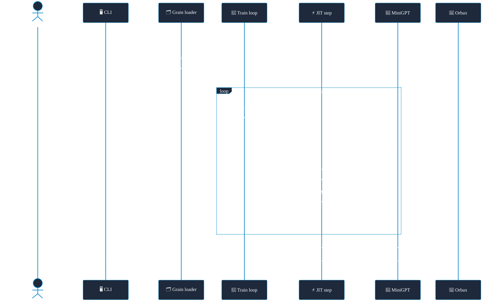
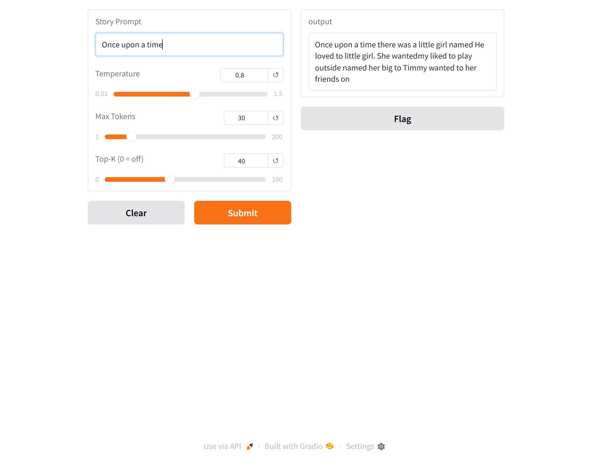

# MiniGPT-JAX

> A tiny GPT-style language model built with **JAX** and **Flax NNX**, small enough to
> train and run on a laptop **CPU** — it learns from TinyStories and generates short
> children's-story text.


Give it a prompt and the model autoregressively samples one token at a time —
tokenising with `tiktoken`, running a stack of causal-attention blocks, and decoding
the result back into text. It trains end-to-end on the bundled
[TinyStories](https://huggingface.co/datasets/roneneldan/TinyStories) slice with AdamW
and a cosine learning-rate schedule, then saves an Orbax checkpoint you can generate
from or serve in a Gradio UI.

It's a complete, installable Python package — model, training loop, sampler,
checkpointing, and a Gradio demo — driven by a single `python -m minigpt` entry point.
The whole thing is built to run on a laptop CPU with no GPU, no WSL, and no manual
setup: clone, `uv sync`, train.


> Trained on the bundled 1,000-story slice. Real story-like prose needs the full
> TinyStories corpus.

## What it demonstrates

- **A GPT from scratch in Flax NNX** — token + position embedding, a stack of causal
  multi-head self-attention blocks, and a linear output head, all as plain
  `nnx.Module` classes driven by a dataclass config.
- **A real JAX training loop** — `@nnx.jit`-compiled step, `nnx.value_and_grad`, AdamW
  with a warmup-cosine LR schedule, and a **padding-masked** cross-entropy loss so the
  model learns real tokens instead of padding.
- **Autoregressive sampling** — temperature scaling with optional top-k, proper PRNG
  key splitting, and a greedy `argmax` fallback at `temperature 0`.
- **KV-cached decoding for CPU speed** — naive generation recomputes the whole context
  window for every new token; this uses a **KV cache** (`decode=True`) so each step is a
  single-token, `jit`-compiled forward pass. On CPU, where every FLOP is felt, that turns
  the quadratic per-token cost into a constant one and is the difference between usable
  and painfully slow.
- **CPU-only, zero-setup runnable** — a ~1,000-story TinyStories slice is committed, and
  every dependency installs as a prebuilt wheel on native Windows Python 3.13 (no WSL).
- **Checkpointing** — Orbax save/restore pinned to CPU sharding, so a model trained in
  one process can be reloaded for generation or the demo.

### Architecture note

The transformer block is **attention-only** — a residual connection around multi-head
self-attention, with no feed-forward network, layer norm, or dropout. That's deliberate,
not an omission: it's the minimal block, kept minimal.

## Modules

| Module | Role |
|--------|------|
| `config.py` | `ModelConfig` + `TrainConfig` dataclasses — every hyperparameter with defaults |
| `model.py` | `MiniGPT`: token+position embedding, causal attention blocks, output head |
| `data.py` | TinyStories loader + Grain data pipeline (`StoryDataset`, right-padding to `maxlen`) |
| `train.py` | Training loop — AdamW, cosine LR schedule, JIT-compiled step, padding-masked loss |
| `generate.py` | Autoregressive text generation with temperature + top-k sampling |
| `checkpoint.py` | Orbax save / restore, pinned to CPU `SingleDeviceSharding` |
| `cli/` | `train` / `generate` / `demo` command implementations |
| `__main__.py` | `python -m minigpt train\|generate\|demo` dispatcher |

```
src/minigpt/
  config.py       model.py      data.py
  train.py        generate.py   checkpoint.py
  __main__.py     cli/
```

## Training flow

`python -m minigpt train`: TinyStories in, a checkpoint out — the step is JIT-compiled
once, then reused for every batch.



## Generation flow

A prompt goes in and the model samples tokens one at a time until it emits end-of-text
or hits the token budget.



## Requirements

- Python **3.12+** (developed and verified on 3.13)
- CPU is sufficient — no GPU required

## Install

`uv sync` creates the `.venv` and installs the exact locked versions from `uv.lock`:

```bash
uv sync
```

Then either activate the environment:

```bash
# Windows:
.venv\Scripts\activate
# macOS/Linux:
source .venv/bin/activate
```

…or prefix each command with `uv run` (no activation needed), e.g.
`uv run python -m minigpt train ...`.

The `dev` dependency group (pytest) is included by default. For a runtime-only
environment, use `uv sync --no-dev` and invoke the venv Python directly — a later
`uv run` would re-add the dev group.

## Usage

All commands run through `python -m minigpt <command>`. This module-based entry
point works everywhere — including locked-down Windows environments where generated
`.exe` console-script shims are blocked by security policy.

### Train

Trains on a slice of TinyStories and writes a checkpoint:

```bash
python -m minigpt train
```

The defaults train on all 1000 bundled stories for 20 epochs — budget ~20 minutes on a
laptop CPU. For a fast pipeline check, shrink it: `--max-stories 100 --epochs 3`.

Common flags: `--data-path`, `--checkpoint-path`, `--max-stories`, `--epochs`,
`--batch-size`, `--peak-lr`, `--shuffle`, plus architecture flags (`--embed-dim`,
`--num-heads`, `--num-blocks`, `--maxlen`).

> **Quality is bounded by the tiny bundled dataset.** 1000 stories is enough to move
> the loss well off random and produce more word-like output, but not fully coherent
> prose. Real story-like text requires the full TinyStories corpus (millions of
> stories) and many more steps.

### Generate

```bash
python -m minigpt generate --checkpoint minigpt_checkpoint.orbax \
  --prompt "Once upon a time" --max-new-tokens 30 --temperature 0.8 --top-k 40
```

Decoding uses **temperature sampling with optional top-k**:

- `--temperature` controls randomness. Low (`0.2`) is focused and repetitive; high
  (`1.0`+) is diverse but riskier. `--temperature 0` forces greedy `argmax` decoding.
- `--top-k` restricts sampling to the K most likely tokens (default 40), which avoids
  picking implausible tokens. `--top-k 0` disables it.
- `--seed` makes a run reproducible; change it for a different sample.

### Interactive demo

Launches a local Gradio web UI:

```bash
python -m minigpt demo --checkpoint minigpt_checkpoint.orbax
```



## Tests

```bash
uv run python -m pytest
```

The suite (14 tests) covers the model forward-pass shape and its causal mask, the
dataset padding and truncation (including that a truncated story still ends in the
end-of-text token), the padding-masked loss (padding positions are ignored, and an
all-padding batch stays finite), generation (returns a string, is deterministic for a
fixed seed, and falls back to greedy decoding at `temperature 0`), that KV-cached decode
produces the same logits as a full-sequence forward pass, and graceful Ctrl-C shutdown of
the demo CLI. It runs on CPU in seconds and needs no checkpoint.

## Data

`data/TinyStories-1000.txt` is a ~1,000-story slice of TinyStories, included so the
project runs with zero setup. It is **not** the full dataset. Stories are separated by
the `<|endoftext|>` token.

## Acknowledgments

The model architecture, training recipe, and TinyStories workflow come from the
DeepLearning.AI short course
[**"LLMs with JAX"**](https://www.deeplearning.ai/short-courses/). This repository
repackages that course's teaching notebooks into an installable, CPU-runnable Python
package. Thanks to the [TinyStories](https://huggingface.co/datasets/roneneldan/TinyStories)
authors for the dataset and to the JAX, Flax, Optax, Grain, and Orbax teams for the
libraries it's built on.

## License

MIT — see [LICENSE](LICENSE).
